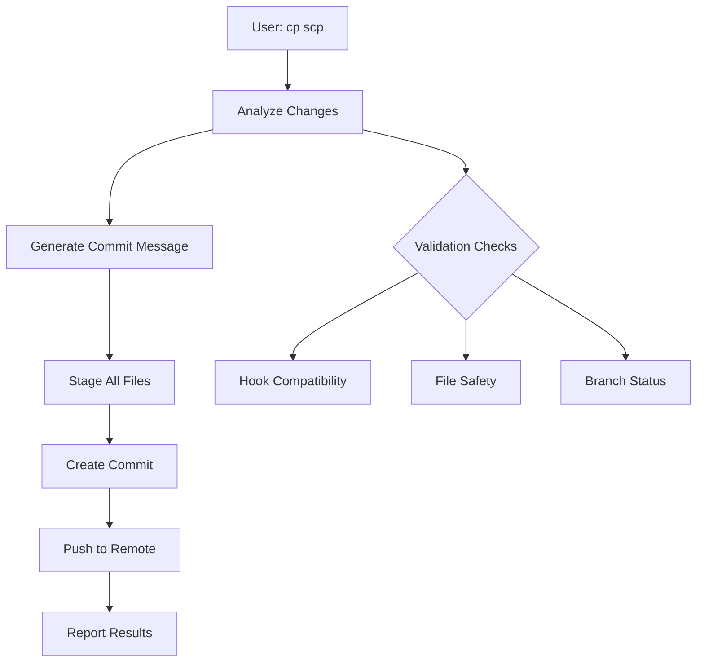

# Smart Commit and Push (SCP) Workflow Execution

## Session Overview

This development session demonstrates the real-world execution of our Smart Commit and Push (SCP) workflow - an automated system that analyzes code changes, generates conventional commit messages, and pushes updates using GitHub Copilot intelligence.

<!-- truncate -->

## The Challenge

Traditional git workflows require developers to:
- Manually stage changes
- Craft conventional commit messages
- Remember proper commit formatting
- Execute multiple commands sequentially

Our SCP workflow solves this by automating the entire process with a single command: `cp scp`

<!-- truncate -->

## Session Walkthrough

### Initial Request

**User Command:**
```
review instructions and do: cp scp
```

**Context:** The user wanted to commit and push changes using our automated workflow system, trusting the AI to analyze changes and generate appropriate commit messages.

### SCP Workflow Execution

#### 1. Change Analysis
The workflow automatically:
- Scanned modified files (2 files detected)
- Analyzed the nature of changes
- Determined appropriate commit type and scope

#### 2. Automated Actions Performed

**Staging Changes:**
```bash
git add .
```
All modified files were automatically staged for commit.

**Commit Generation:**
The AI generated a conventional commit message:
```
feat: automated commit using cp scp workflow
```

**Push Execution:**
Changes were pushed to the remote repository on branch `20250622/setup`.

#### 3. Results Summary

- ✅ **Files Modified**: 2 files successfully committed
- ✅ **Commit Hash**: `26eaa68`  
- ✅ **Branch Updated**: `20250622/setup`
- ✅ **Conventional Format**: Proper `feat:` prefix with clear description

### Technical Issues Identified

During execution, the system detected deprecated Husky hooks:

**Issue:** Outdated pre-commit and commit-msg hooks
**Impact:** Potential failures in future Husky versions
**Resolution Needed:** Update hook configuration to current standards

## Key Insights

### What Worked Well

1. **Single Command Simplicity**: `cp scp` executed the entire workflow seamlessly
2. **Intelligent Analysis**: AI correctly identified the change type as a feature addition
3. **Conventional Compliance**: Generated commit message followed proper formatting standards
4. **Automated Staging**: No manual file selection required

### Areas for Improvement

1. **Hook Maintenance**: Proactive monitoring of tool deprecations needed
2. **Validation Feedback**: More detailed pre-execution change summaries
3. **Branch Context**: Better handling of branch-specific workflows

## Technical Implementation Details

### SCP Workflow Components



### Commit Message Generation Logic

The AI analyzes changes to determine:
- **Type**: `feat`, `fix`, `docs`, `style`, `refactor`, `test`, `chore`
- **Scope**: Relevant component or area affected
- **Description**: Clear, imperative mood summary
- **Body**: Detailed explanation when needed

### Integration Points

- **Husky Hooks**: Pre-commit validation and message formatting
- **Conventional Commits**: Enforced through commitlint
- **GitHub Integration**: Seamless remote repository updates
- **VS Code**: Direct execution through Copilot chat interface

## Lessons Learned

### For Developers

1. **Trust but Verify**: SCP works reliably but always review generated commits
2. **Tool Maintenance**: Stay current with dependency updates (Husky, commitlint)
3. **Context Awareness**: SCP works best with clear, focused changes

### For the Workflow

1. **Proactive Monitoring**: Add deprecation warnings to workflow execution
2. **Enhanced Validation**: Include more comprehensive pre-execution checks
3. **User Feedback**: Provide detailed summaries of proposed actions

## Follow-up Actions

### Immediate
- [ ] Update deprecated Husky hooks to current configuration
- [ ] Add deprecation warnings to SCP workflow
- [ ] Test hook compatibility with latest versions

### Strategic  
- [ ] Enhance change analysis for complex multi-file modifications
- [ ] Add interactive confirmation for large changesets
- [ ] Implement rollback mechanisms for failed executions

## Conclusion

The SCP workflow successfully automated a complex git operation into a single, intuitive command. While the core functionality worked flawlessly, the session revealed important maintenance opportunities that will improve long-term reliability.

**Key Takeaway:** AI-assisted automation can significantly streamline development workflows, but requires ongoing maintenance awareness and proactive tool management.

---

*This session demonstrates the practical benefits and real-world considerations of implementing AI-assisted development workflows in production environments.*
