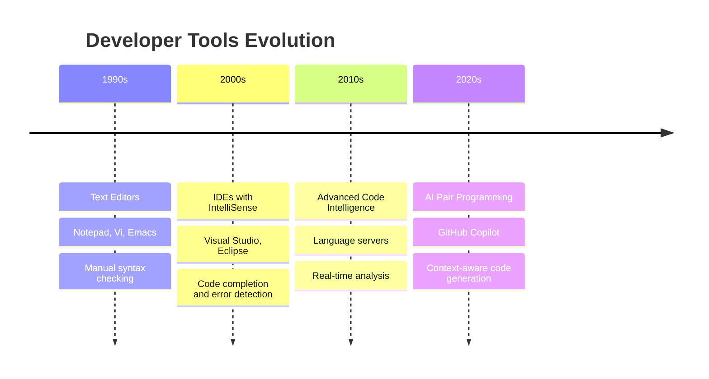

# Getting Started with GitHub Copilot

## Introduction to AI Pair Programming

### What is GitHub Copilot?

**GitHub Copilot** is an AI-powered coding assistant developed by GitHub in partnership with OpenAI. Unlike traditional autocomplete tools, Copilot functions as a true coding partner, understanding context, project structure, and development patterns to provide intelligent assistance.

### Key Characteristics

- **AI-Powered**: Built on advanced language models trained on billions of lines of code
- **Context-Aware**: Understands your entire project and surrounding code context
- **Multi-Language**: Supports JavaScript, TypeScript, Python, Go, C#, Java, Ruby, and more
- **IDE Integration**: Seamlessly integrates into VS Code, Visual Studio, and other editors

## Evolution of Developer Tools

### The Journey from Text Editors to AI Assistance



### What Makes AI Different

Traditional tools provide:
- Syntax highlighting
- Basic autocomplete
- Error detection
- Refactoring suggestions

AI pair programming adds:
- **Contextual Understanding**: Knows what you're trying to achieve
- **Multi-file Awareness**: Understands project architecture
- **Natural Language Processing**: Converts comments to code
- **Learning Capability**: Adapts to your coding patterns

## Core Capabilities

### 1. Intelligent Autocomplete

Beyond simple word completion, Copilot provides:

- **Whole Line Suggestions**: Complete logical statements
- **Function Generation**: Entire functions from comments or signatures
- **Pattern Recognition**: Consistent coding style application
- **Context Sensitivity**: Suggestions based on surrounding code

### 2. Chat Integration

Interactive coding assistance through:

- **Code Explanation**: "What does this function do?"
- **Debugging Help**: "Why isn't this working?"
- **Refactoring Suggestions**: "How can I improve this code?"
- **Learning Support**: "Show me best practices for..."

### 3. Multi-file Awareness

Copilot understands:

- **Project Structure**: File relationships and dependencies
- **Import Statements**: Automatic import suggestions
- **Type Systems**: TypeScript/language-specific type awareness
- **Architectural Patterns**: Consistent pattern application

### 4. Comment-to-Code Generation

Transform natural language into working code:

```javascript
// Function to calculate compound interest with monthly contributions
// Takes principal, annual rate, years, and monthly contribution
// Returns total amount after specified years
function calculateCompoundInterest(principal, annualRate, years, monthlyContribution) {
    const monthlyRate = annualRate / 12 / 100;
    const totalMonths = years * 12;
    
    // Future value of initial principal
    const futureValuePrincipal = principal * Math.pow(1 + monthlyRate, totalMonths);
    
    // Future value of monthly contributions (annuity)
    const futureValueContributions = monthlyContribution * 
        ((Math.pow(1 + monthlyRate, totalMonths) - 1) / monthlyRate);
    
    return futureValuePrincipal + futureValueContributions;
}
```

## Setting Up GitHub Copilot

### Prerequisites

- **GitHub Account**: Free or paid account
- **Supported Editor**: VS Code, Visual Studio, JetBrains IDEs, Neovim
- **Internet Connection**: Required for AI model access

### Installation Steps

#### VS Code Setup

1. **Install Extension**
   ```bash
   # Via VS Code Marketplace
   # Search for "GitHub Copilot" by GitHub
   ```

2. **Authentication**
   - Click the Copilot icon in the sidebar
   - Sign in with your GitHub account
   - Follow the authentication flow

3. **Verification**
   - Open a new file
   - Start typing a comment or function
   - Look for Copilot suggestions (gray text)

### Free vs Paid Plans

#### GitHub Copilot Free (2024+)
- **2,000 completions/month** (~80/day)
- **50 chat requests/month**
- **Access to GPT-4o and Claude 3.5 Sonnet**
- **Basic features** included

#### GitHub Copilot Pro ($10/month)
- **Unlimited completions and chat**
- **Priority access** to new features
- **Advanced models** (o1, Gemini)
- **Faster response times**

#### Enterprise Plans
- **Team management** and governance
- **Code indexing** for private repositories
- **Policy controls** and compliance features
- **Usage analytics** and reporting

## Your First Copilot Experience

### Basic Interaction Pattern

1. **Write Intent**: Start with a comment describing what you want
2. **Review Suggestion**: Copilot provides code suggestions
3. **Accept or Modify**: Tab to accept, or continue typing to refine
4. **Iterate**: Build on the suggestion or request alternatives

### Example: Creating a REST API Endpoint

```javascript
// Create an Express.js endpoint to get user profile by ID
// Should handle authentication and return user data
app.get('/api/users/:id', authenticateToken, async (req, res) => {
    try {
        const userId = req.params.id;
        
        // Validate user ID format
        if (!mongoose.Types.ObjectId.isValid(userId)) {
            return res.status(400).json({ error: 'Invalid user ID format' });
        }
        
        // Find user by ID, excluding sensitive fields
        const user = await User.findById(userId)
            .select('-password -resetToken -__v')
            .lean();
        
        if (!user) {
            return res.status(404).json({ error: 'User not found' });
        }
        
        // Check if requesting user can access this profile
        if (req.user.id !== userId && req.user.role !== 'admin') {
            return res.status(403).json({ error: 'Access denied' });
        }
        
        res.json({ user });
    } catch (error) {
        console.error('Error fetching user profile:', error);
        res.status(500).json({ error: 'Internal server error' });
    }
});
```

### Key Learning Points

- **Start with Intent**: Clear comments lead to better suggestions
- **Iterative Development**: Build up complexity gradually
- **Review Everything**: AI suggestions should be validated and tested
- **Context Matters**: More context leads to better suggestions

## Next Steps

- 🔥 **Advanced Features** - Deep dive into Copilot's powerful capabilities
- 🛠️ **Practical Workflows** - Real-world development scenarios and patterns
- ⚡ **Prompt Engineering** - Crafting effective AI instructions for better results
- ⚠️ **Security Best Practices** - Maintaining code security with AI assistance
