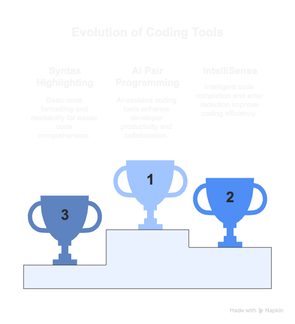

# Beyond Autocomplete: Mastering AI Pair Programming with GitHub Copilot

## Microsoft Denver Developer Day

June 27, 2025

<!-- 
Total Duration: 50 minutes
Talk Type: Live Demo & Interactive Presentation
Audience: Mixed skill levels - beginners to advanced developers
Focus: Practical, hands-on approach with real-world examples
-->

---

## What we will cover

### Key Topics

1. **Introduction to GitHub Copilot**: What it is, how it works, and its evolution.
2. **Core Features**: Autocomplete, Chat Integration, Comment-to-Code, Multi-file Awareness, Test Generation.
3. **Custom Copilot Instructions**: Tailored workflows and directives for specific tasks.
4. **Advanced Techniques**: Prompt engineering and workflow integration.
5. **Security Considerations**: Best practices for safe AI-assisted coding.
6. **Real-World Applications**: Industry use cases and success stories.

<!-- 
Speaker Notes:
- Provide a roadmap for the session to set expectations.
- Highlight the mix of theory, demos, and practical takeaways.
- Emphasize the interactive nature of the presentation.
- Mention that the session will cover both beginner-friendly and advanced topics.
-->

---

## 🎯 The Future is Now

### Welcome to the Future of Development

- **"Beyond Autocomplete: Mastering AI Pair Programming with GitHub Copilot"**
- Matt Vaughn - BuildMotion | Angular Architect & Author
- Microsoft Denver Developer Day 2025

### The Developer Tools Evolution Journey

- **From Syntax Highlighting → IntelliSense → AI Pair Programming**
- Timeline visualization: Text editors → IDEs → AI-assisted coding
- **Interactive Poll**: "How many of you are currently using AI coding tools daily?"

<!-- 
Speaker Notes:
- Personal connection: "I've been building web applications since 1998 - literally watched this entire evolution unfold"
- Share brief anecdote: "Started with Visual InterDev|Notepad|DreamWeaver and FTP uploads, now we have AI writing code with us"
- Acknowledge the room's diverse experience levels: "Whether you're AI-curious or already prompting like a pro"
- Reference my Angular Architecture book experience: "Just like architectural patterns evolved from backend to frontend, AI assistance is the next logical step"
- Set interactive tone: "This isn't just a demo session - we're going to transform how you think about coding collaboration"
- Technical credibility: "Having authored enterprise Angular patterns, I've seen what works at scale - and AI pair programming is game-changing"
- Promise value: "By the end, you'll have practical workflows you can implement Monday morning"
-->

---

## Coding Olympics

<!-- 
Speaker Notes:
- Evolution of IDE
  - syntax highlighting: "We started with basic syntax highlighting in text editors"
  - IntelliSense: "Then came IntelliSense, which was a game-changer for code completion"
  - AI Pair Programming: "Now we have AI that not only completes code but understands context and intent"
- Emphasize the rapid pace of change: "In just a few years
-->

---

## 📚 Foundation & Context (8 minutes)

### What is GitHub Copilot?

- **AI-powered coding assistant** from GitHub & OpenAI *(Microsoft's $7.5B investment at work)*
- **Trained on billions of lines** of "public" code *(wink wink)*
- **Integrated directly** into your IDE *(because why leave when they know everything about you?)*
- **Context-aware**: Reads your project like it's gossip *(and probably judges your naming conventions)*

<!-- 
Speaker Notes:
- *deadpan delivery* "It's not magic, folks - it's just trained on billions of lines of code from GitHub repositories. You know... all that code you uploaded thinking it was 'private'?" *pause for effect* 
- *slight smirk* "Microsoft bought GitHub in 2018 for 7.5 billion. Wonder how they got all that sweet, sweet training data, right?? I'm just saying..." *shrug*
- *lean forward conspiratorially* "This isn't your grandpa's IntelliSense. This thing reads your entire project like it's binge-watching Netflix - understands your imports, your patterns, probably judges your variable names..."
- *raise eyebrow* "They say it's 'context-aware.' Translation: it knows when you're about to write another nested ternary operator and judges you accordingly"
- *serious tone shift* "But seriously though - this isn't glorified autocomplete. It's an AI that understands coding context better than most developers understand their own codebase" 
- *back to snark* "Built on GPT architecture - you know, the same tech that confidently tells you there are 11 letters in 'strawberry.' But hey, at least it writes clean code!"
- *pause* "Supports 40+ programming languages... because apparently JavaScript wasn't enough suffering for one lifetime" *wait for laughs*
- *timing note: pause after each snarky comment to let it land, then transition smoothly to next point*
-->

---

### Brief History & Evolution

- **June 2021**: Preview launch (invitation only)
- **June 2022**: General availability
- **2023**: Copilot X with Chat integration
- **December 2024**: Free tier launched with 2,000 completions/month
- **2025**: Multi-model support (GPT-4o, Claude 3.5 Sonnet)

<!-- 
Speaker Notes:
- Highlight the rapid evolution and GitHub's commitment to the platform
- Mention the recent free tier as lowering barriers to entry for developers
- Note that it's constantly improving with new models (GPT-4o, Claude 3.5 Sonnet, with o1 and Gemini arriving soon)
- Emphasize how this evolution shows Microsoft/GitHub's long-term investment in AI-assisted development
- Connect to research: The tool has matured from experimental to production-ready in just 4 years
-->

---

### The Research Behind the Hype

- **55.8% faster task completion** (GitHub/Keio University study)
- **75% of developers feel more fulfilled** using Copilot
- **46% reported writing less boilerplate code**
- **60%+ of VS Code users** with Copilot use it daily

<!-- 
Speaker Notes:
- Start with: "Let's talk numbers - not marketing numbers, but peer-reviewed research"
- 55.8% improvement is from controlled studies with hundreds of developers
- The fulfillment metric is crucial: "This isn't just about speed, it's about job satisfaction"
- Less boilerplate = more time for creative problem-solving and architecture
- Daily usage shows sticky adoption - once developers try it, they integrate it into their workflow
- Ask audience: "How many of you spend time on repetitive coding tasks you wish you could automate?"
- Position research as validation: "The productivity gains are real and measurable"
- Transition: "But enough talking about it - let me show you how to get these results yourself"
-->

---

## 🛠️ Getting Started - Live Demo (7 minutes)

### Setup in Under 60 Seconds

- **Live Demo**: Fresh VS Code installation

1. Open VS Code
2. Click Copilot icon in sidebar
3. Sign in with GitHub account
4. Start coding immediately

<!-- 
Speaker Notes:
- Do this live to show how frictionless it is
- Emphasize no complex configuration needed
- If demo fails, have screenshots as backup
- Show the setup is truly under a minute
-->

---

### Your First Copilot Experience

- **Live Demo**: Create a new JavaScript file
- Type a comment: `// Function to calculate compound interest`
- Watch Copilot suggest the entire function
- Accept suggestion and test it

<!-- 
Speaker Notes:
- Choose a universally understood example (compound interest)
- Show the suggestion overlay and how to accept/reject
- Demonstrate that it's not just completing syntax but understanding intent
- Test the generated code to show it actually works
-->

---

## 🚀 Core Capabilities Deep Dive (12 minutes)

### Copilot Modes & Features

| Feature | What It Does | When to Use |
|---------|-------------|-------------|
| **Autocomplete** | Suggests code as you type | Daily coding, function completion |
| **Chat Integration** | Ask questions, get explanations | Understanding unfamiliar code |
| **Comment-to-Code** | Natural language → working code | Rapid prototyping |
| **Multi-file Awareness** | Understands project context | Complex refactoring |
| **Test Generation** | Creates unit tests from functions | Improving code coverage |

<!-- 
Speaker Notes:
- Walk through each feature with purpose
- Emphasize when to use each mode
- Set up for the upcoming demos
-->

---

### Autocomplete in Action

- **Demo**: Build a React component from scratch
- Show how Copilot predicts entire JSX structures
- Demonstrate CSS-in-JS suggestions
- Show prop typing suggestions

<!-- 
Speaker Notes:
- Choose a universally understood component (e.g., TodoList or UserCard)
- Start with just a comment: "// React component for displaying user profile"
- Show how Copilot understands framework patterns and suggests appropriate props
- Highlight context awareness: imports, existing components, TypeScript interfaces
- Demonstrate the intelligence beyond simple autocomplete - understanding component architecture
- If demo fails, have a pre-recorded backup showing the same progression
- Time estimate: 3-4 minutes maximum to maintain audience engagement
-->

---

### Chat Integration

- **Demo**: Select confusing code and ask Copilot Chat to explain
- Ask: "How can I optimize this function?"
- Ask: "Generate unit tests for this component"
- Show inline chat vs. sidebar chat

<!-- 
Speaker Notes:
- Use code that's genuinely complex or unclear
- Show different types of questions you can ask
- Demonstrate both explanation and generation capabilities
-->

---

### Multi-file Awareness

- **Demo**: Create a utility function in one file
- Show how Copilot suggests imports in another file
- Demonstrate project-wide context understanding

<!-- 
Speaker Notes:
- This is where Copilot really shines vs. simpler tools
- Show it's not just about single file completion
- Emphasize the intelligence of cross-file suggestions
-->

---

## 🚀 Advanced Capabilities & Use Cases (12 minutes)

### Slide: Deep Dive into `@workspace`

- **What is `@workspace`?**
  - A prompt capability that leverages your entire project context.
  - Ideal for answering questions like "What is this repository about?" or "Where is the main entry point?"

<!-- 
Speaker Notes:
- Explain `@workspace` as a way to query the entire project context.
- Show practical examples: "What is this repository about?" and "Where is the main entry point?"
- Highlight its utility for onboarding new developers or understanding unfamiliar codebases.
- Mention limitations: works best with well-structured projects.
- Transition: "Now let’s see how it compares to `#codebase`."
-->

---

### Slide: Comparing `@workspace` and `#codebase`

- **`@workspace`**: Context-aware, project-wide insights.
- **`#codebase`**: Focused on specific files or folders.
- **Use Cases**:
  - `@workspace`: High-level understanding, onboarding.
  - `#codebase`: Debugging, targeted exploration.

<!-- 
Speaker Notes:
- Use a comparison table to highlight differences.
- Provide examples for each: `@workspace` for project summaries, `#codebase` for debugging.
- Emphasize that both are complementary tools.
- Transition: "Let’s explore how these capabilities enhance test generation."
-->

---

### Slide: Enhancing Test Generation with Copilot

- **Configuration for Nx/Angular/Jest**:
  - Use `github.copilot.chat.testGeneration.instructions` in `settings.json`.
  - Tailored for `apps` and `libs` structure.
- **Benefits**:
  - Automates repetitive test creation.
  - Reduces boilerplate.
  - Improves test coverage.

<!-- 
Speaker Notes:
- Show configuration example from `copilot-test-generation-instructions.md`.
- Highlight benefits: automation, reduced boilerplate, better coverage.
- Mention challenges: requires clear project structure and naming conventions.
- Transition: "Finally, let’s look at how Copilot integrates into your workflow."
-->

---

### Slide: Practical Workflow Integration

- **Daily Use Cases**:
  - Writing boilerplate code.
  - Debugging and refactoring.
  - Learning new frameworks.
- **Tips**:
  - Use `@workspace` for project-wide insights.
  - Use `#codebase` for targeted exploration.

<!-- 
Speaker Notes:
- Provide real-world examples: debugging, refactoring, learning.
- Share tips for maximizing Copilot’s capabilities.
- End with: "Copilot isn’t just a tool; it’s a partner in your development journey."
-->

---

### Slide: Custom Instructions in GitHub Copilot

- **What are Custom Instructions?**
  - Tailored prompts to guide Copilot's behavior.
  - Define specific rules, preferences, or workflows.
- **How to Use Them:**
  - Configure in `.github/instructions/` directory.
  - Apply to specific files or entire projects.
- **Benefits:**
  - Improve code consistency across teams.
  - Automate repetitive tasks with precision.
  - Enhance Copilot's understanding of project-specific needs.

<!-- 
Speaker Notes:
- Explain the concept of custom instructions as a way to tailor Copilot's behavior.
- Show examples of instruction files (e.g., `nx.instructions.md`, `ai-troubleshooting.instructions.md`).
- Highlight practical benefits like enforcing team standards and automating workflows.
- Mention that instructions can be scoped to specific files or applied globally.
- Transition: "Let’s see how these instructions can be leveraged in real-world scenarios."
-->

---

## 💼 Real-World Use Cases (10 minutes)

### Slide: Industry Applications

- **Shopify**: Developer onboarding acceleration
- **Azure SDK Teams**: Documentation generation
- **Startups**: MVP prototyping speed
- **Open Source**: Test coverage and PR summaries
- **Education**: Interactive learning and concept explanation

<!-- 
Speaker Notes:
- These are real examples from the research, not hypothetical use cases
- Shopify specifically uses Copilot in developer bootcamps to accelerate engineer onboarding
- Azure SDK teams leverage it for writing example usage documentation for SDK libraries
- Startups report significant velocity improvements in MVP development cycles
- Open source maintainers use it for PR summaries and improving test coverage
- Educational institutions are using it as an interactive learning tool for teaching syntax and algorithms
- Connect to audience: "Think about your current role - which of these scenarios applies to your team?"
- Transition: "Let me show you some of these use cases in action"
-->

---

### Live Demo: Documentation Generation

- **Demo**: Take an undocumented function
- Use Copilot to generate JSDoc comments
- Show README.md generation from code
- Generate API documentation

<!-- 
Speaker Notes:
- Documentation is often neglected - show how Copilot helps
- Use a function complex enough that manual docs would be tedious
- Show both inline docs and external documentation
-->

---

### Live Demo: Test Generation

- **Demo**: Create unit tests for a complex function
- Show different testing frameworks (Jest, Mocha)
- Generate edge cases and error conditions
- Create integration tests

<!-- 
Speaker Notes:
- Testing is where many developers need help
- Show how Copilot thinks about edge cases
- Demonstrate multiple testing approaches
-->

---

### Live Demo: Legacy Code Modernization

- **Demo**: Take ES5 code and modernize to ES6+
- Convert callback patterns to async/await
- Add TypeScript types to JavaScript
- Refactor class components to hooks

<!-- 
Speaker Notes:
- Many developers deal with legacy code
- Show how Copilot understands modern patterns
- Emphasize incremental modernization approach
-->

---

## ⚡ Advanced Techniques & Prompt Engineering (5 minutes)

### Slide: Crafting Better Prompts

- **Be specific**: "// Sort array of objects by date ascending" vs "// Sort array"
- **Provide context**: Include relevant imports and variable names
- **Set style preferences**: "// Using functional programming style"
- **Specify constraints**: "// Without using external libraries"

<!-- 
Speaker Notes:
- Show side-by-side examples of vague vs. specific prompts
- Emphasize that better input leads to better output
- These techniques separate beginners from power users
-->

---

### Live Demo: Prompt Engineering in Practice

- **Demo**: Compare results from different prompt styles
- Show how context affects suggestions
- Demonstrate style consistency across a project

<!-- 
Speaker Notes:
- Use the same function with different prompts
- Show tangible differences in output quality
- Emphasize that this is a learnable skill
-->

---

## ⚠️ Security & Best Practices (3 minutes)

### Slide: Security Considerations

- **~30% of AI-generated code** may contain vulnerabilities
- **Common issues**: XSS, insecure randomness, hardcoded secrets
- **Solution**: Use Copilot Chat to review and improve security
- **Best practice**: Always review, test, and validate AI suggestions

<!-- 
Speaker Notes:
- Reference the specific research from your studies: "This isn't marketing FUD - it's from peer-reviewed research"
- Be honest about limitations to build trust with the audience
- Emphasize that this isn't anti-AI, it's pro-responsible AI use
- Mention that Copilot Chat can fix ~55% of identified security issues when prompted correctly
- Show this positions AI as part of the security solution, not just the problem
- Connect to enterprise concerns: "This is why Business/Enterprise plans include governance controls"
- Emphasize: "The goal is human-AI collaboration, not blind automation"
-->

---

### Live Demo: Security Review with Copilot

- **Demo**: Generate code with potential security issues
- Use Copilot Chat to identify and fix vulnerabilities
- Show how to ask security-focused questions

<!-- 
Speaker Notes:
- Create a realistic example (password handling, user input)
- Show how Copilot can be part of the security solution
- Emphasize defense in depth approach
-->

---

## 💰 Pricing & Plans (2 minutes)

### Slide: Choose Your Plan

| Plan | Features | Price | Best For |
|------|----------|-------|----------|
| **Free** | 2,000 completions/mo, 50 chats, GPT-4o + Claude | $0 | Individual developers, learning |
| **Pro** | Unlimited usage, advanced models, previews | $10/mo | Professional developers |
| **Business** | Team management, policy controls | Custom | Development teams |
| **Enterprise** | Governance, codebase indexing, private models | Custom | Large organizations |

<!-- 
Speaker Notes:
- Emphasize the generous free tier for getting started
- Pro plan is excellent value for professional developers
- Business/Enterprise add governance and security features
-->

---

## 🎯 Key Takeaways & Action Items (3 minutes)

### Slide: What You've Learned Today

✅ **Copilot is a coding partner, not just autocomplete**  
✅ **Free tier removes barriers to getting started**  
✅ **Multiple interaction modes for different scenarios**  
✅ **Real productivity gains with proper usage**  
✅ **Security awareness and best practices matter**  
✅ **Prompt engineering improves results significantly**

<!-- 
Speaker Notes:
- Reinforce key concepts from the presentation
- Emphasize practical next steps
- Connect back to the "beyond autocomplete" theme
-->

---

### Slide: Your Next Steps

1. **Today**: Download VS Code and enable Copilot free tier
2. **This week**: Try different interaction modes in your current project
3. **This month**: Experiment with prompt engineering techniques
4. **Ongoing**: Share learnings with your team

**Resources**:

- [github.com/features/copilot](https://github.com/features/copilot)
- [code.visualstudio.com/docs/copilot](https://code.visualstudio.com/docs/copilot)

<!-- 
Speaker Notes:
- Give concrete, actionable next steps
- Provide timeline for adoption
- Share resource links for continued learning
-->

---

## 🤔 Q&A Session (5 minutes)

### Slide: Questions & Discussion

- **Share your experiences** with AI coding tools
- **Ask about specific use cases** in your projects
- **Discuss team adoption strategies**
- **Explore advanced scenarios** we didn't cover

<!-- 
Speaker Notes:
- Encourage sharing of experiences, not just questions
- Be prepared for common questions about:
  - Cost justification for teams
  - Integration with existing workflows
  - Concerns about code quality
  - Privacy and enterprise usage
- Have backup demos ready for specific requests
-->

---

## 📋 Backup Content & Contingencies

### Emergency Demos (if live coding fails)

- **Screenshots** of each major demo
- **Recorded GIFs** showing key interactions
- **Code samples** in markdown for manual walkthrough

### Extended Q&A Topics

- **Team onboarding strategies**
- **Integration with CI/CD pipelines**
- **Measuring productivity impact**
- **Alternative AI coding tools comparison**
- **Future of AI-assisted development**

### Technical Difficulties Backup

- **Offline VS Code** with Copilot pre-configured
- **Mobile hotspot** for internet issues
- **Pre-recorded demo videos** as last resort

<!-- 
Speaker Notes:
- Always have multiple backup plans for live demos
- Technical difficulties are common - be prepared
- Audience appreciates transparency when things go wrong
- Keep the energy up even with technical issues
-->

---

## 📝 Speaker Preparation Checklist

### Pre-Talk Setup

- [ ] VS Code with Copilot configured and tested
- [ ] Demo project repository cloned and ready
- [ ] Internet connection stable and tested
- [ ] Backup internet connection available
- [ ] All demo code paths tested and working
- [ ] Screenshots/recordings as backup ready

### Demo Environment

- [ ] Clean VS Code workspace with no distractions
- [ ] Font size large enough for back of room
- [ ] Dark theme for better projection visibility
- [ ] Relevant extensions installed and configured
- [ ] Demo projects with clear, understandable examples

### Presentation Materials

- [ ] Slides exported to PDF as backup
- [ ] Resource links tested and accessible
- [ ] Contact information and social media ready
- [ ] Business cards or digital contact sharing method
- [ ] Feedback collection method prepared

<!-- 
Speaker Notes:
- Check every item before the presentation
- Test everything at the venue if possible
- Have multiple backup plans for each component
- Practice the demo flow multiple times
- Time each section to ensure proper pacing
-->

---

## 🎤 Meet the Speaker

### About Matt Vaughn

- **Web Development Pioneer**: Matt built his first web application in 1998 and has been innovating ever since.
- **Angular Enthusiast**: Author of "Angular Architecture" and host of "Angularlicious Podcast."
- **Community Contributor**: Speaker at Angular Connect, local meetups, and international conferences.
- **Personal Touch**: A Colorado native with a passion for jazz, tacos, and technology.

<!-- Speaker Notes:
- Matt Vaughn has over two decades of experience in web development, specializing in Angular and TypeScript.
- He authored "Angular Architecture," a book that provides insights into modern front-end architecture.
- Matt hosts "Angularlicious Podcast," where he shares best practices and enterprise patterns.
- Highlight his contributions to the Angular community through workshops and talks.
- Share his personal interests to connect with the audience: jazz, tacos, and his Colorado roots.
-->
